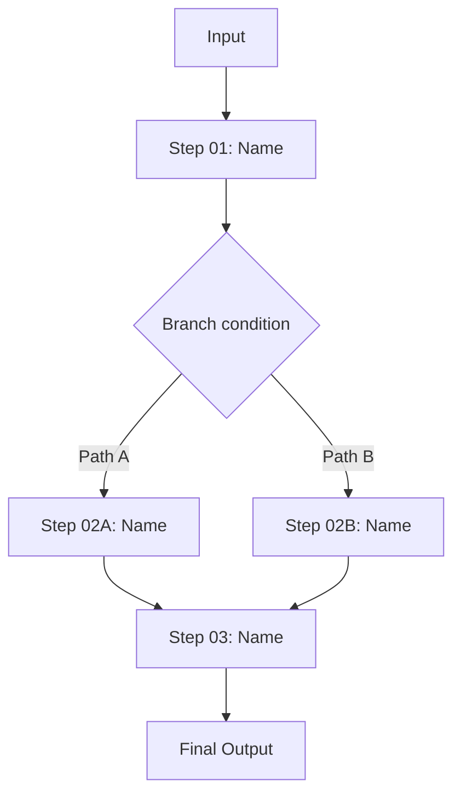

# Blueprint Document Template

Output file name: `./blueprint-<task-name>.md`

Use the exact section headers below so `scripts/validate_blueprint_doc.py` can validate the result deterministically.

```markdown
# [Task Name] Codex Automation Blueprint
> Created: YYYY-MM-DD
> Purpose: Codex implementation blueprint

## 0. Goals and Deliverables

### Primary Goal
[What problem this workflow solves]

### Success Definition
- [Observable completion condition]
- [Observable quality threshold]

### Out of Scope
- [Explicitly excluded items]

## 1. Working Context

### Background
[Business or operational context]

### Objective
[What the Codex workflow must accomplish]

### Scope
- Included: [...]
- Excluded: [...]

### Inputs
| Item | Format | Source | Notes |
|---|---|---|---|
| [input] | [md/json/csv/api] | [user/system/file] | [notes] |

### Outputs
| Item | Format | Destination | Notes |
|---|---|---|---|
| [output] | [md/json/csv] | [path/system] | [notes] |

### Constraints
- [Technical constraint]
- [Operational constraint]
- [Risk or policy constraint]

### Terms
| Term | Definition |
|---|---|
| [term] | [meaning] |

## 2. Workflow Definition

### End-to-End Flow

분기가 2개 이상이면 Mermaid를 사용한다. 단순 선형 흐름은 텍스트도 가능.



### LLM vs Code Boundary
| LLM handles | Code handles |
|---|---|
| [Decision, interpretation, synthesis] | [Parsing, I/O, validation, API calls] |

#### Step 01: [Name]
1) Step Goal:
[What this step achieves]

2) Input / Output:
- Input: [...]
- Output: [...]

3) LLM Decision Area:
[What requires model judgment]

4) Code Processing Area:
[What should be deterministic or scripted]

5) Success Criteria:
[How to know the step is complete]

6) Validation Method:
[Schema, rule-based, human review, or self-check]

7) Failure Handling:
[Retry, escalate, skip, or abort]

8) Skills / Scripts:
- Skill: [name or none]
- Script: [path or none]

9) Intermediate Artifact Rule:
`output/step01_<name>.<ext>`

#### Step 02: [Name]
1) Step Goal:
[...]

2) Input / Output:
- Input: [...]
- Output: [...]

3) LLM Decision Area:
[...]

4) Code Processing Area:
[...]

5) Success Criteria:
[...]

6) Validation Method:
[...]

7) Failure Handling:
[...]

8) Skills / Scripts:
- Skill: [name or none]
- Script: [path or none]

9) Intermediate Artifact Rule:
`output/step02_<name>.<ext>`

### State Model
| State | Entry Condition | Exit Condition | Next State |
|---|---|---|---|
| `COLLECTING_REQUIREMENTS` | [When requirements are being clarified] | [Requirements are usable] | `PLANNING` |
| `PLANNING` | [Blueprint is being organized] | [Plan is ready] | `RUNNING_SCRIPT` or `VALIDATING` |
| `RUNNING_SCRIPT` | [A deterministic helper is executing] | [Script succeeds or fails] | `VALIDATING` or `FAILED` |
| `VALIDATING` | [Output is being checked] | [Validation result known] | `DONE` or `NEEDS_USER_INPUT` or `FAILED` |
| `NEEDS_USER_INPUT` | [Human decision is required] | [User answers] | `PLANNING` or `DONE` |
| `DONE` | [Final deliverable is accepted] | [Terminal] | [none] |
| `FAILED` | [Recovery is not possible] | [Terminal] | [none] |

## 3. Implementation Spec

### Recommended Folder Structure
```text
/project-root
  AGENTS.md
  /.agents
    /skills
      /<skill-name>
        SKILL.md
        /agents
          openai.yaml          # optional UI metadata
        /scripts        # optional
        /references     # optional
        /assets         # optional
  /.codex
    /agents
      /<agent-name>.toml    # optional custom subagent
  /output
  /scripts              # optional project scripts
  /docs                 # optional supporting docs
```

### AGENTS.md Responsibilities
- [How the main Codex instructions route work]
- [What the project-level constraints are]
- [How skills are invoked or referenced]

### Custom Agent Definitions
| Name | Path | Role | Required Fields |
|---|---|---|---|
| [agent-name or none] | `.codex/agents/[agent-name].toml` or none | [when custom subagents are justified] | `name`, `description`, `developer_instructions` |

### Skill and Script Inventory
| Name | Type | Role | Trigger Condition |
|---|---|---|---|
| [skill-name] | skill/script | [responsibility] | [when it is used] |

### AGENTS.md 작성 원칙

이 시스템의 AGENTS.md는 아래 4가지 원칙을 따라 작성한다. 규칙 나열이 아닌 원칙 중심으로, 50줄 이내로 압축한다.

| 원칙 | 핵심 | 자기 검증 테스트 |
|------|------|-----------------|
| **구현 전에 생각하라** | 가정을 명시하고, 불명확하면 멈추고 물어라 | "내 가정을 명시적으로 진술했는가?" |
| **단순함 우선** | 요청한 것만 구현, 추측성 추상화 금지 | "시니어 엔지니어가 '너무 복잡하다'고 할까?" |
| **수술적 변경** | 건드려야 할 것만 건드리고, 기존 스타일에 맞출 것 | "모든 변경 줄이 요청에 직접 연결되는가?" |
| **목표 중심 실행** | 성공 기준 정의 → 검증 루프 | "성공/실패를 객관적으로 판단할 수 있는가?" |

**트레이드오프**: [이 가이드라인의 편향 방향 명시. 예: "신중함 > 속도. 단순 작업에는 판단력을 사용하라."]

**이 가이드라인이 잘 작동하고 있다면:**
- [기대 효과 1]
- [기대 효과 2]
- [기대 효과 3]

> 상세 원칙은 `references/design-principles.md` › "AGENTS.md / CLAUDE.md 작성 원칙" 참조.

### Skill Creation Rules

> 이 설계서에 정의된 모든 스킬은 구현 시 반드시 `skill-creator` 스킬(`/skill-creator`)을 사용하여 생성할 것.
> 직접 SKILL.md를 수동 작성하지 말 것 — 규격 불일치 및 트리거 실패의 원인이 됨.

skill-creator가 보장하는 규격:
1. SKILL.md frontmatter (`name`, `description`) 필수 필드 준수
2. `description`의 트리거 정확도 최적화 (eval 기반 optimization loop)
3. 스킬 저장 위치 `.agents/skills/<skill-name>/` 규격 준수
4. 폴더 구조 (`SKILL.md` + `scripts/` + `references/`) 규격 준수
5. Progressive disclosure: SKILL.md 본문 500줄 이내, 대용량 참조는 `references/`로 분리
6. 테스트 프롬프트 실행 및 품질 검증 완료

### Core Artifacts
| Path | Format | Producer | Purpose |
|---|---|---|---|
| `output/stepNN_<name>.<ext>` | [json/md/csv] | [step] | [purpose] |

## 4. Validation Checklist

- [ ] Every workflow step has all 9 required fields
- [ ] Intermediate artifacts use the `output/stepNN_<name>.<ext>` rule
- [ ] LLM vs code responsibilities are separated clearly
- [ ] Human review points are explicit where needed
- [ ] Codex skill paths use `.agents/skills/...`
- [ ] Codex custom subagents use `.codex/agents/*.toml`
- [ ] `Custom Agent Definitions` section is present and uses `.codex/agents/*.toml` paths
- [ ] `AGENTS.md 작성 원칙` section is present with 4 principles + self-verification tests + tradeoff + success metrics
- [ ] Skill additions or updates mention `skill-creator`

## 5. Maintenance

This document is a **pre-implementation plan**. When the design changes during implementation:

- **Minor changes** (parameters, filenames): reflect only in implementation code
- **Structural changes** (step add/remove, agent structure change): update the relevant section and record the reason in `### Change Log`
- **Scope changes** (input/output change, new features): re-review the document or write a new blueprint

Change log format:
| Date | Change | Reason |
|---|---|---|
| YYYY-MM-DD | [what changed] | [why] |
```
