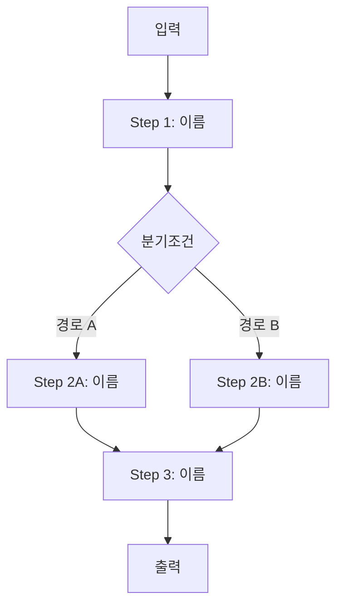

# Blueprint Document Template

Output file name: `blueprint-<task-name>.md`

---

```markdown
# [작업명] 에이전트 시스템 설계서

> 작성일: YYYY-MM-DD
> 목적: Claude Code 구현 참조용 계획서

---

## 1. 작업 컨텍스트

### 배경 및 목적
[왜 이 에이전트가 필요한지, 어떤 문제를 해결하는지]

### 범위
- 포함: [이 에이전트가 다루는 것]
- 제외: [명시적으로 다루지 않는 것]

### 입출력 정의

| 항목 | 내용 |
|------|------|
| **입력** | [입력 형식, 출처, 예시] |
| **출력** | [출력 형식, 저장 위치, 예시] |
| **트리거** | [언제/어떻게 실행되는가] |

### 제약조건
- [기술적 제약: 사용 가능한 도구, API 한도 등]
- [운영 제약: 실행 빈도, 처리량 등]
- [품질 제약: 정확도, 응답 시간 등]

### 용어 정의
| 용어 | 정의 |
|------|------|
| [용어] | [설명] |

---

## 2. 워크플로우 정의

### 전체 흐름도

분기가 2개 이상이면 Mermaid를 사용한다. 단순 선형 흐름은 ASCII도 가능.



### LLM 판단 vs 코드 처리 구분

| LLM이 직접 수행 | 스크립트로 처리 |
|----------------|----------------|
| [판단/추론 작업 목록] | [결정론적 작업 목록] |

### 단계별 상세

#### Step 1: [단계명]

- **처리 주체**: 에이전트 / 스크립트 (`scripts/xxx.py`)
- **입력**: [이전 단계 출력 또는 초기 입력]
- **처리 내용**: [무엇을 하는가]
- **출력**: [결과물 형식 및 저장 위치]
- **성공 기준**: [이 단계가 완료됐다고 볼 수 있는 조건]
- **검증 방법**: 스키마 검증 / 규칙 기반 / LLM 자기 검증 / 사람 검토
- **실패 시 처리**: 자동 재시도 (최대 N회) / 에스컬레이션 / 스킵 + 로그

#### Step 2: [단계명]
[동일 형식 반복]

### 상태 전이

| 상태 | 전이 조건 | 다음 상태 |
|------|----------|----------|
| [상태명] | [조건] | [다음 상태] |

---

## 3. 구현 스펙

### 폴더 구조

```
/project-root
  ├── CLAUDE.md
  ├── /.claude
  │   ├── /skills
  │   │   └── /<skill-name>
  │   │       ├── SKILL.md
  │   │       └── /scripts
  │   └── /agents             # (해당 시)
  │       └── /<agent-name>
  │           └── AGENT.md
  ├── /output
  └── /docs                   # (선택)
```

### CLAUDE.md 핵심 섹션 목록

- [섹션명: 역할 한 줄 설명]
- [섹션명: 역할 한 줄 설명]

### 에이전트 구조

**구조 선택**: 단일 에이전트 / 멀티 에이전트 (오케스트레이터 + 서브에이전트)

**선택 근거**: [왜 이 구조를 선택했는가]

#### 메인 에이전트 (CLAUDE.md)
- **역할**: 전체 워크플로우 오케스트레이션
- **담당 단계**: [Step 1, Step 3 등]

#### 서브에이전트 목록 (해당 시)

| 이름 | 역할 | 트리거 조건 | 입력 | 출력 | 참조 스킬 |
|------|------|-----------|------|------|----------|
| [agent-name] | [역할] | [언제 호출] | [입력 형식] | [출력 형식] | [skill-name] |

### 스킬/스크립트 목록

| 이름 | 유형 | 역할 | 트리거 조건 |
|------|------|------|-----------|
| [skill-name] | 스킬 / 스크립트 | [무엇을 하는가] | [언제 호출되는가] |

### CLAUDE.md 작성 원칙

이 시스템의 CLAUDE.md는 아래 4가지 원칙을 따라 작성한다. 규칙 나열이 아닌 원칙 중심으로, 50줄 이내로 압축한다.

| 원칙 | 핵심 | 자기 검증 테스트 |
|------|------|-----------------|
| **구현 전에 생각하라** | 가정을 명시하고, 불명확하면 멈추고 물어라 | "내 가정을 명시적으로 진술했는가?" |
| **단순함 우선** | 요청한 것만 구현, 추측성 추상화 금지 | "시니어 엔지니어가 '너무 복잡하다'고 할까?" |
| **수술적 변경** | 건드려야 할 것만 건드리고, 기존 스타일에 맞출 것 | "모든 변경 줄이 요청에 직접 연결되는가?" |
| **목표 중심 실행** | 성공 기준 정의 → 검증 루프 | "성공/실패를 객관적으로 판단할 수 있는가?" |

**트레이드오프**: [이 가이드라인의 편향 방향 명시. 예: "신중함 > 속도. 단순 작업에는 판단력을 사용하라."]

**이 가이드라인이 잘 작동하고 있다면:**
- [기대 효과 1]
- [기대 효과 2]
- [기대 효과 3]

> 상세 원칙은 `references/design-principles.md` › "CLAUDE.md / AGENTS.md 작성 원칙" 참조.

### 스킬 생성 규칙

> 이 설계서에 정의된 모든 스킬은 구현 시 반드시 `skill-creator` 스킬(`/skill-creator`)을 사용하여 생성할 것.
> 직접 SKILL.md를 수동 작성하지 말 것 — 규격 불일치 및 트리거 실패의 원인이 됨.

skill-creator가 보장하는 규격:
1. SKILL.md frontmatter (`name`, `description`) 필수 필드 준수
2. `description`의 트리거 정확도 최적화 (eval 기반 optimization loop)
3. 폴더 구조 (`SKILL.md` + `scripts/` + `references/`) 규격 준수
4. Progressive disclosure: SKILL.md 본문 500줄 이내, 대용량 참조는 `references/`로 분리
5. 테스트 프롬프트 실행 및 품질 검증 완료

### 주요 산출물 파일

| 파일 | 형식 | 생성 단계 | 용도 |
|------|------|----------|------|
| `/output/[filename]` | JSON / MD / CSV | Step N | [용도] |

### 검증 체크리스트

- [ ] 모든 단계에 성공 기준 / 검증 방법 / 실패 시 처리가 있다
- [ ] LLM 판단 vs 코드 처리 구분 표가 채워져 있다
- [ ] `CLAUDE.md 작성 원칙` 섹션이 4원칙 + 자기 검증 테스트 + 트레이드오프 + 성공 지표를 포함한다
- [ ] `스킬 생성 규칙` 섹션이 있고 `skill-creator`를 명시한다
- [ ] 에이전트 구조가 단일/멀티 중 하나로 명시되어 있다
- [ ] 표와 섹션에 `TBD` 같은 미완성 표기가 남아 있지 않다

### 설계서 유지보수

이 설계서는 **구현 전 계획**이다. 구현 중 설계가 변경되면 아래 규칙을 따른다:

- **경미한 변경** (파라미터, 파일명 등): 설계서 업데이트 없이 구현 코드에만 반영
- **구조적 변경** (단계 추가/삭제, 에이전트 구조 변경): 설계서의 해당 섹션을 업데이트하고 변경 이유를 `### 변경 이력`에 기록
- **범위 변경** (입출력 변경, 새 기능 추가): 설계서를 재검토하거나 새 blueprint를 작성

변경 이력 형식:
| 날짜 | 변경 내용 | 이유 |
|------|----------|------|
| YYYY-MM-DD | [변경 사항] | [변경 이유] |
```

---

## Notes for the author

- Fill every table cell — never leave "TBD" in the final document
- If a workflow step has no branching, omit the branch diagram for that step
- Sub-agent section is optional — omit entirely for single-agent designs
- Scripts in the script list should be named with their future file path (e.g., `scripts/parse_input.py`)
- Step naming supports variants: `Step 2A`, `Step 2B`, `Step 2M` etc. for branching paths
